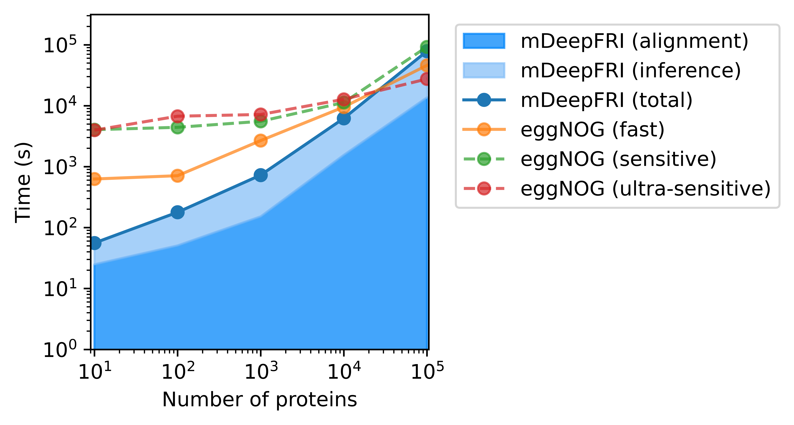
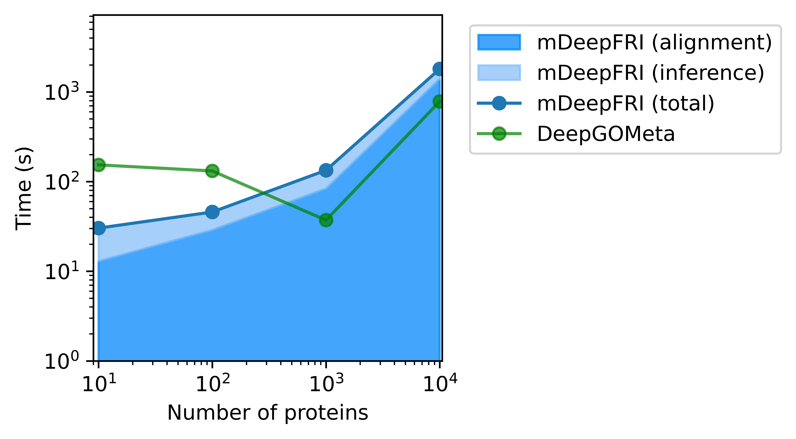

# Benchmark

This folder contains scripts and results for benchmarking the performance of
**Metagenomic-DeepFRI** against **EggNOG-mapper** (v2.1.13).

## Contents

- `time_benchmark_cpu.py`: Python script that:
    1. Generates random protein sequences (10, 100, 1000, 10000) sampled from
       SwissProt.
    2. Introduces random mutations (5-80% of sequence length) to simulate
       random metagenomic proteins.
    3. Runs EggNOG-mapper (fast mode) and mDeepFRI on these sequences.
    4. Measures execution time and logs results.

- `time_benchmark_gpu.py`: Python script that runs the GPU benchmark
  comparing mDeepFRI against DeepGOMeta.

- `benchmaprk_results.ipynb`: Jupyter Notebook for analyzing the benchmark
  logs and plotting the results. It separates mDeepFRI runtime into "Search"
  and "Inference" phases.

- `benchmark_results.tsv`: Tab-separated values file containing the raw
  execution times (CPU).

- `benchmark_results_gpu.tsv`: Tab-separated values file containing the raw
  execution times (GPU).

- `benchmark_time_cpu_comparison.png`: A plot comparing the execution times
  on CPU (log-log scale).

- `benchmark_time_gpu_comparison.png`: A plot comparing the execution times
  on GPU (log-log scale).

## Results

### Comparison of Execution Time (CPU)

| Sequences | EggNOG (fast) [s] | mDeepFRI [s] | Speedup |
|-----------|-------------------|--------------|---------|
| 10        | 619.12            | 251.63       | 2.5x    |
| 100       | 713.73            | 103.77       | 6.9x    |
| 1000      | 1951.38           | 668.44       | 2.9x    |
| 10000     | 5534.66           | 6390.46      | 0.9x    |

mDeepFRI demonstrates superior performance compared to EggNOG-mapper (fast
mode) on CPU, particularly for smaller query sets. The initial overhead of
mDeepFRI is noticeable in the 10-sequence run. As the number of sequences
increases, the alignment/search phase dominates the runtime. For very large
datasets (10,000 sequences), EggNOG-mapper becomes slightly faster in this
benchmark. The stacked area in the plot for mDeepFRI distinguishes between the
database search time (dark blue) and the GCN inference time (light blue).

### Comparison of Execution Time (GPU)

| Sequences | mDeepFRI [s] | DeepGOMeta [s] |
|-----------|--------------|----------------|
| 10        | 30.33        | 153.93         |
| 100       | 45.86        | 131.68         |
| 1000      | 133.92       | 37.23          |
| 10000     | 1810.14      | 784.78         |

When running on GPU, optimization strategies differ between the two tools:
**mDeepFRI** uses ONNX Runtime, whereas **DeepGOMeta** uses PyTorch with
optimizations for GPU compute.

**mDeepFRI** shows significantly lower overhead for small batches (10 and 100
sequences), making it faster for small-scale analysis. This is likely due to
lighter initialization of the ONNX session.

**DeepGOMeta**, conversely, has a high startup cost (approx. 130-150s), likely
attributable to loading large PyTorch models. However, it scales much better for
large datasets (10,000 sequences), where it outperforms mDeepFRI by a factor of
more than 2x. This highlights the trade-off between initialization time and
throughput: caching and batch processing improvements in the PyTorch
implementation pay off for larger inputs.
