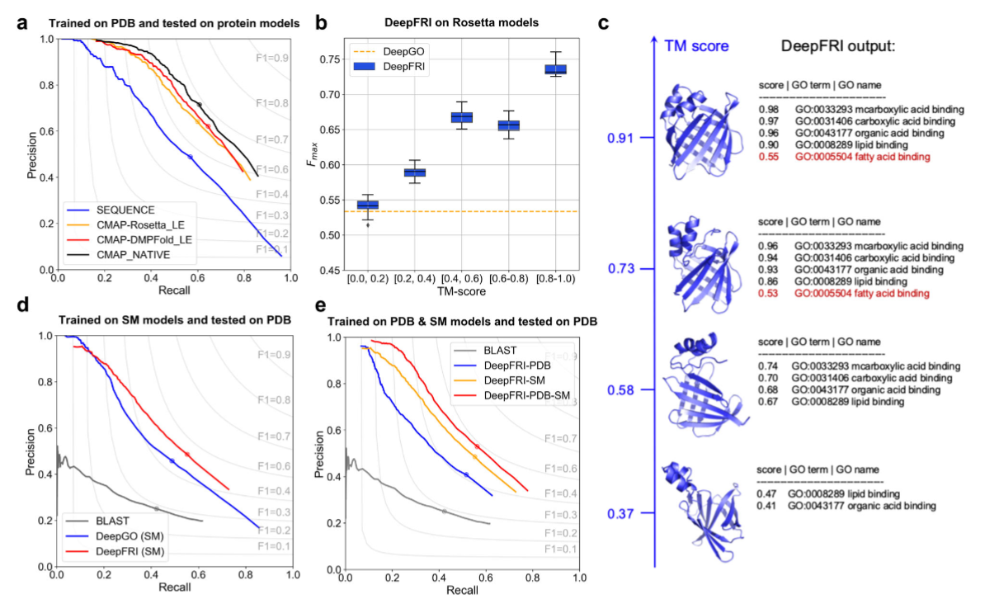

Result Interpretation
=====================

The ``mDeepFRI predict-function`` CLI command outputs the file ``results.tsv`` with the following columns:

1. **Protein**: protein ID from FASTA file.
2. **GO_term/EC_number**: predicted GO term or EC number.
3. **Score**: confidence score of DeepFRI model.
4. **Annotation**: verbose annotation of the GO term or EC number.
5. **Neural_net**: a type of neural net used for prediction (gcn - structure + sequence; cnn - sequence only).
6. **DeepFRI_mode**: prediction mode of DeepFRI.
    * **ec**: EC number prediction.
    * **bp**: GO term prediction for biological process.
    * **mf**: GO term prediction for molecular function.
    * **cc**: GO term prediction for cellular component.
7. **DB_hit**: ID of the best hit from the database - used as a template.
8. **DB_name**: name of the database used.
9. **Identity**: sequence identity between the query and the template.
10. **Coverage**: sequence coverage between the query and the template.

The protein template is defined as a sequence with at least 50% sequence identity and 90% sequence coverage,
as with these parameters we observe mostly the same folds [#]_. Majority of proteins will not differ in structure above this threshold [#]_.
Predicted structures are as useful as experimental ones (Fig. 1a). The bad quality of the structure does decrease
the verbosity of predicted GO terms, yet predictions still remain accurate due to the contribution of the sequence module (Fig. 1b, c).

.. rubric:: Bibliography
.. [#] `Barrio-Hernandez, I. et al. Clustering predicted structures at the scale of the known protein universe. Nature 622, 637–645 (2023). <https://doi.org/10.1038/s41586-023-06510-w>`_
.. [#] `Koehler Leman, J. et al. Sequence-structure-function relationships in the microbial protein universe. Nat Commun 14, 2351 (2023). <https://doi.org/10.1038/s41467-023-37896-w>`_
.. [#] `Gligorijević, V. et al. Structure-based protein function prediction using graph convolutional networks. Nat Commun 12, 3168 (2021). <https://doi.org/10.1038/s41467-021-23303-9>`_
