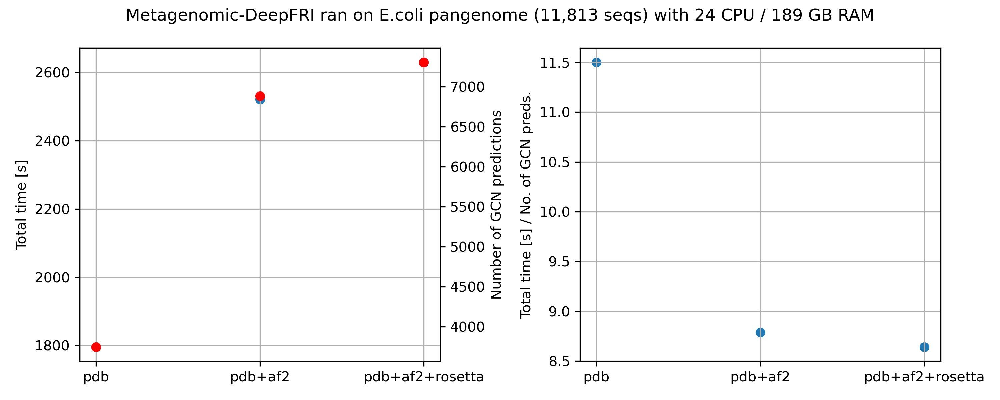

============================
*E. Coli* pangenome analysis
============================

To test our tool, we decided to annotate *Escherichia Coli* pangenome. *Escherichia Coli* is a well-studied
bacterial species. It is a facultative anaerobic, Gram-negative, rod-shaped bacterium abundant in human gut 
microbiome. It colonizes the gut within hours after birth and coexist with human throughout whole life\ :footcite:p:`Kaper_2004`.
It also may exhibit pathogenic properties if it acquires virulence factors. 
We used a pipeline that consists of `kneaddata <https://huttenhower.sph.harvard.edu/kneaddata/>`_, 
``MegaHIT``\ :footcite:p:`Li_2015`, ``MetaBAT2``\ :footcite:p:`Kang_2019`, ``CheckM``\ :footcite:p:`Parks_2015`, 
and ``GTDB-tk``\ :footcite:p:`Chaumeil_2019`, for assembly, quality control, taxonomical annotation of 
metagenome-assembled genomes (MAGs). We used ``Prodigal``\ :footcite:p:`Hyatt_2010` to predict genes and clustered 
sequences by 95% similarity and 90% alignment coverage using ``CD-HIT``\ :footcite:p:`Fu_2012` to generate 
non-redundant gene catalogue. This procedure yielded 11,813 protein sequences. 

Metagenomic-DeepFRI uses 2 inputs: **protein sequence** and **protein structure**. As we obtained the protein sequences
in the previous step, we still do not have the protein structure. Luckily, after running  ``update_target_mmseqs_database.py``
the pipeline takes care of it. It searches for the similar sequence in supplied database using Bit-score. If similar sequences
exists in database, it sends the structure as the input to a graph-convolutional neural network (GCN). If there is no such sequence,
the prediction is made with help of convolutional neural network (CNN).

We tested the influence of database on the DeepFRI predictions. We used the following databases:

1. `PDB <https://www.rcsb.org/>`_
2. `AlphaFold2 <https://alphafold.ebi.ac.uk/>`_
3. Rosetta

   
  Figure 1. (left) The amount of predictions made by GCN with respect to reference database. 
  (right) The time elapsed for a single prediction.

Next, we took a closer look on predicted GO terms. We excluded predictions with confidence < 0.2.
We compared predictions with and without structural input.

We defined **informative GO terms** that satisfy the following parameters:

1. Terms that are associated with more than k=2,000 proteins
2. Rach of their descendant term contains less than 2,000 proteins (k=2,000 equates to approximately 1 of every 5,000 UniRef50 protein families). 

.. list-table:: Method
   :widths: 50 30 30
   :header-rows: 1

   * - Method
     - No structural input 
     - PDB + AF2 + Rosetta
   * - No. unfiltered GO terms
     - 11,726 (99%)
     - 7,219 (61%)
   * - Informative GO terms
     - 2,016 (17%)
     - 3,012 (25%)

The number of total predicted GO terms decreased, but the number of informative GO terms increased.

.. rubric:: References

.. footbibliography::
