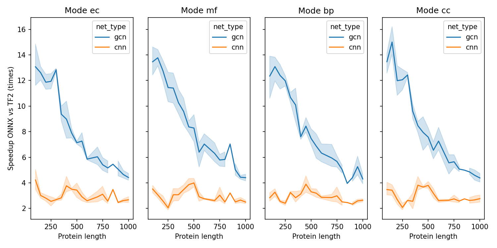

# TF2 to ONNX conversion

This part contains scripts for converting original TF2 models to ONNX format, tests for reproducible output and measurements for performance.
- Every original DeepFRI CPU model was converted from Tensorflow format to ONNX using `tf2onnx` package.
- Prediction were made on 100 random proteins and the numerical difference was not larger than `1e-5`.
- The performance of the models was measured on a single CPU core.
- The time was compared for both formats.

The plot shows a relative speedup after conversion of models to ONNX:

